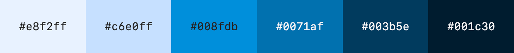

# flutter_reasonable_colors

This is a Flutter package for the open-source color system Reasonable Colors, made by Matthew Howell.

## Features

- Reasonable Colors is free and open source.
- Reasonable colors are accessible.
- Reasonable colors are easy to use.

## Installation

```console
dart pub add flutter_reasonable_colors
```

## Getting started

Each ColorSwatch constant is a color and can used directly. For example:

```dart
Container(
  color: ReasonableColors.blue, // same as ReasonableColors.blue[300] or ReasonableColors.blue.shade300
)
```

## Shades

Each color comes in 6, numbered shades. The contrast between any two shades can be inferred by the difference between their shade numbers.

## Contrast

Minimum contrast can be inferred by the difference between two SHADE numbers

- The contrast between any shades with a difference of **2** (shade-2 and shade-4, for example) will be at least **3:1**.
- The contrast between any shades with a difference of **3** (shade-2 and shade-5, for example) will be at least **4.5:1**.
- The contrast between any shades with a difference of **4** (shade-2 and shade-6, for example) will be at least **7:1**.

## Colors

- Gray


- Rose


- Raspberry


- Red


- Orange


- Cinnamon


- Amber


- Yellow


- Lime


- Chartreuse


- Green


- Emerald


- Aquamarine


- Teal


- Cyan


- Powder


- Sky


- Cerulean


- Azure



- Blue


- Indigo


- Violet


- Purple


- Magenta


- Pink


## Additional information

More information available at: https://www.reasonable.work/colors